# AUFGABE 3: SPRING BOOT FULLSTACK DEPARTMENT-MANAGEMENT

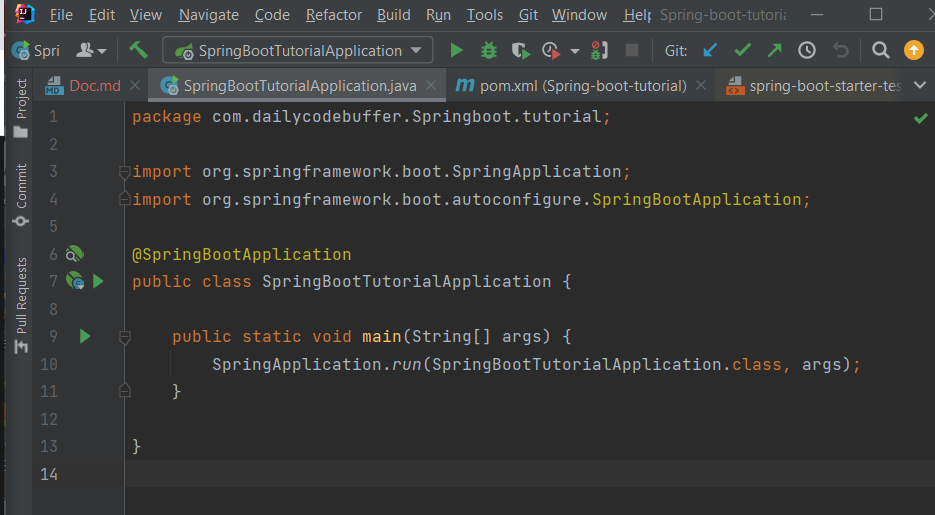

## Table of Contents
1. [Creating Simple API](#creating-simple-api)
2. [Creating Springboard Components](#creating-springboard-components)
3. [CRUD Operations](#crud_operations)

## Creating Simple API 

Ein simpler Controller wird erstellt.
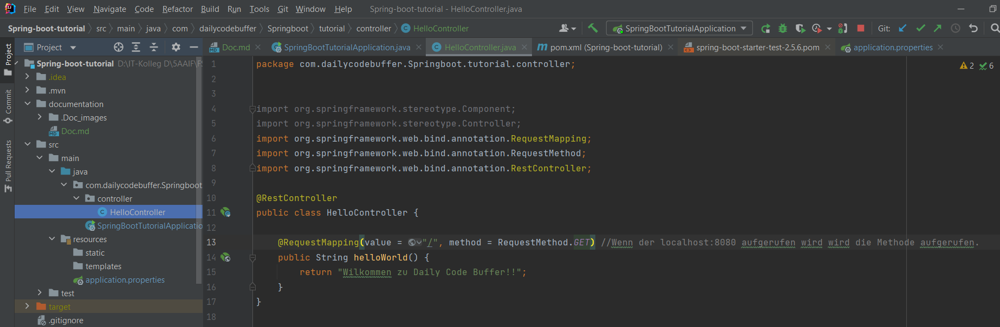

Port wird verändert.
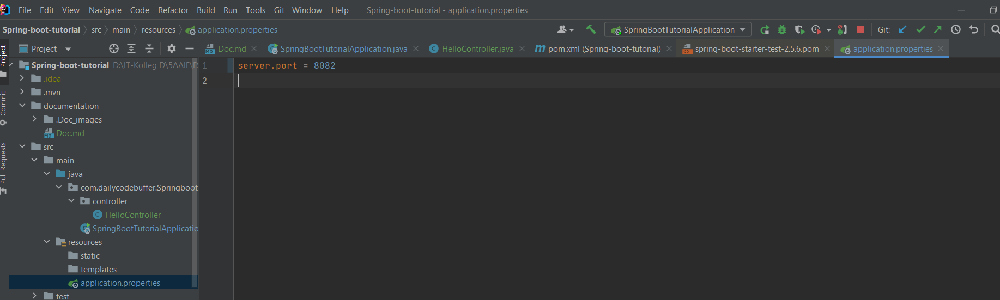

Re-run:

Auto-Update:
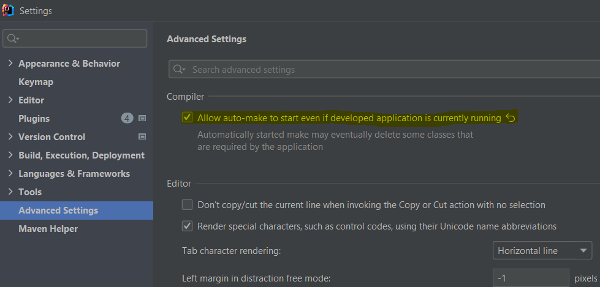
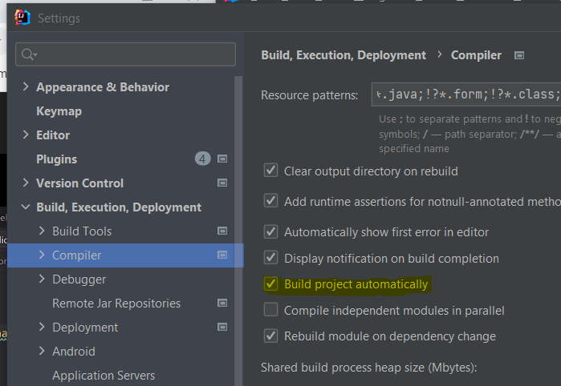
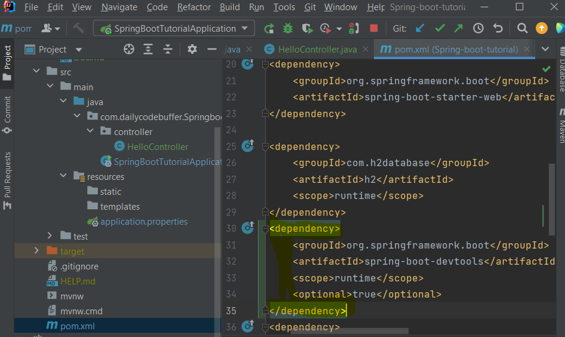

## Creating Springboard Components 

Add H2 and JPA Dependency
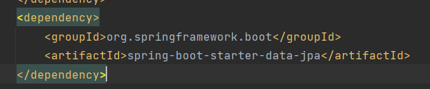

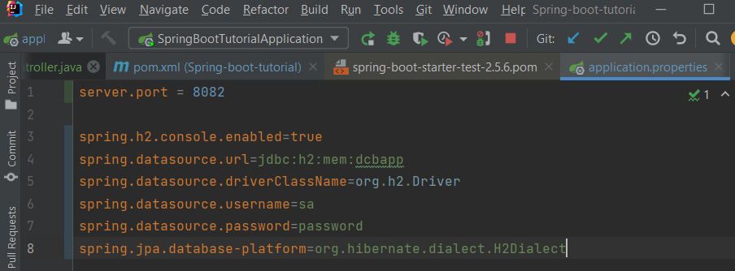

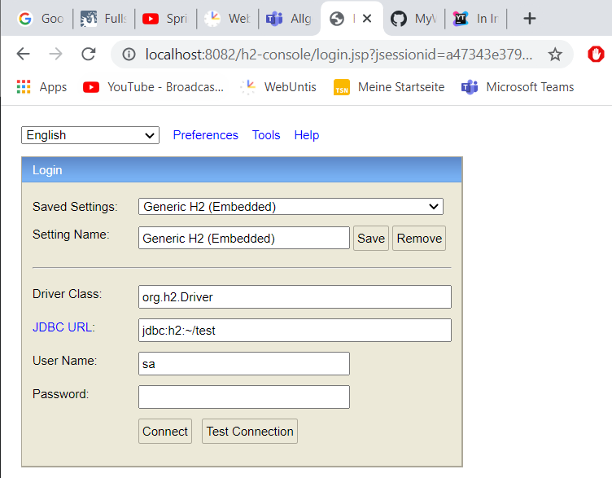

### Creating Components

Department Entity 
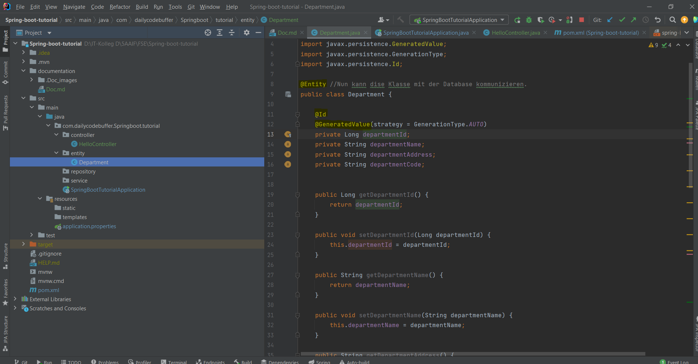

Department Controller 
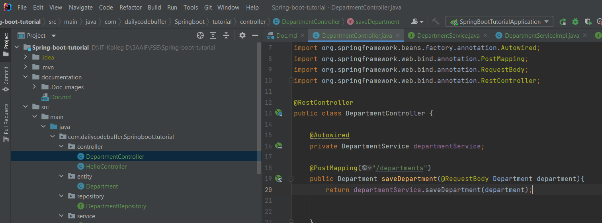
Department Service 
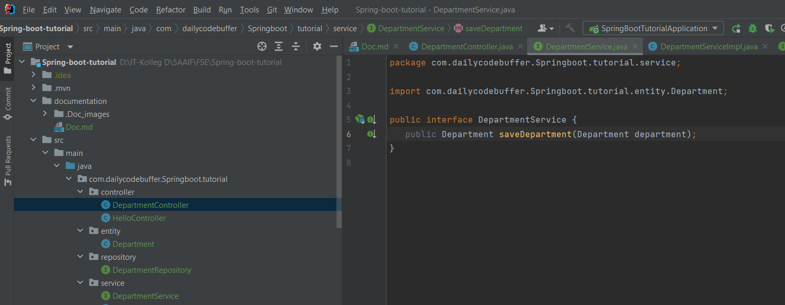
Department Service-Implementation
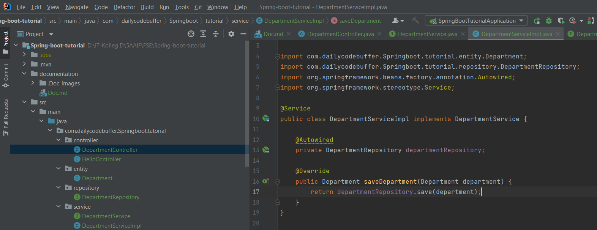
Department Repository
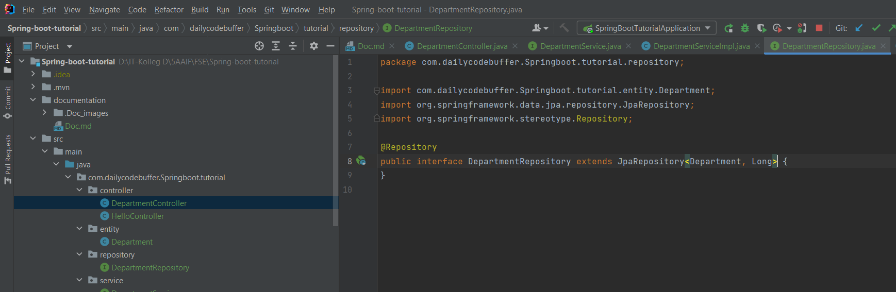

Resultat im Browser:
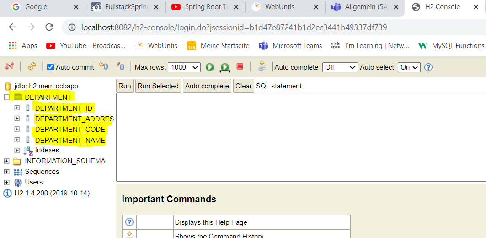

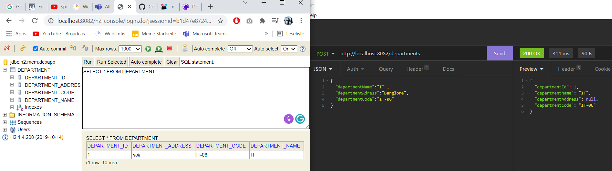

## CRUD Operations 

### GetMapping

Controller
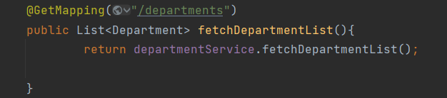
Service

Service Implementation
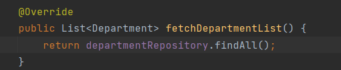

### Fetching Data by ID

Controller:
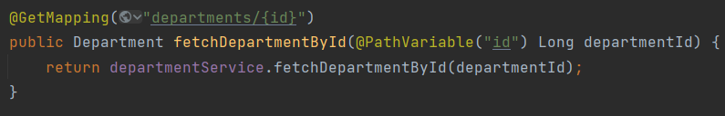
Service:
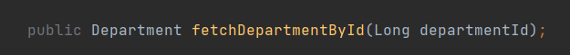
Service Implementation:
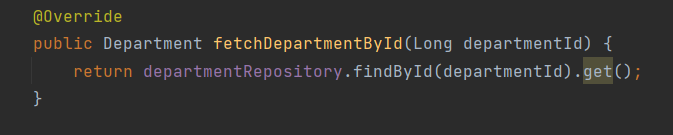

### Delete by ID:

Controller:
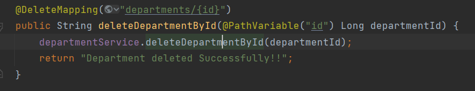
Service:
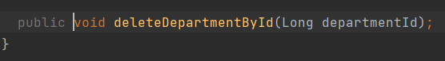
Service Implementation:
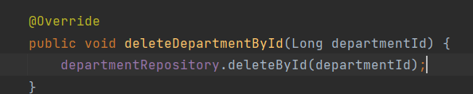

### Update:

Controller:
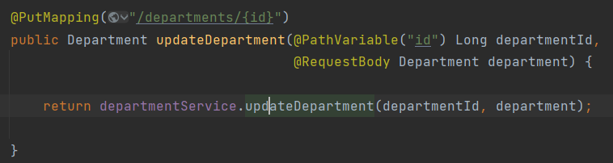
Service:
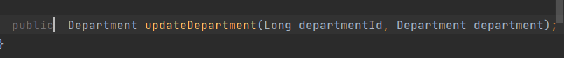
Service Implementation:
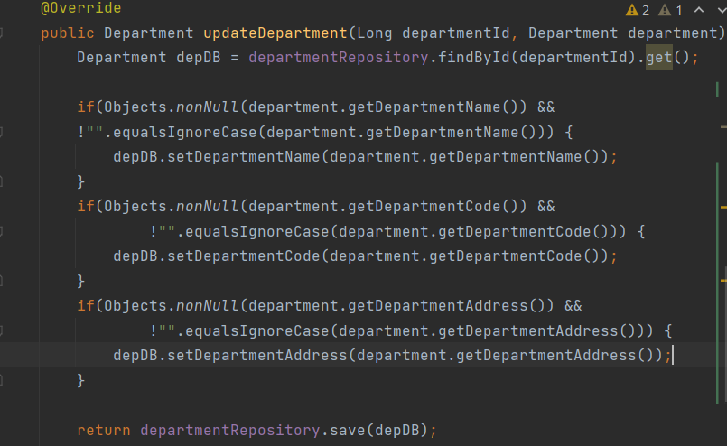

