# AUFGABE 3: SPRING BOOT FULLSTACK DEPARTMENT-MANAGEMENT

## Table of Contents
1. [Creating Simple API](#creating-simple-api)
2. [Creating Springboard Components](#creating-springboard-components)
3. [CRUD Operations](#crud_operations)
4. [Add Loggers](#add_loggers)
5. [Exception Handling](#exception_handling)
6. [Change to MySql](#change_database)
7. [TESTING](#testing)

## Creating Simple API 

Ein simpler Controller wird erstellt.

Port wird verändert.

Re-run:

Auto-Update:

## Creating Springboard Components 

Add H2 and JPA Dependency

### Creating Components

Department Entity 

Department Controller 

Department Service 

Department Service-Implementation

Department Repository

Resultat im Browser:

## CRUD Operations 

### GetMapping

Controller

Service

Service Implementation

### Fetching Data by ID

Controller:

Service:

Service Implementation:

### Delete by ID:

Controller:

Service:

Service Implementation:

### Update:

Controller:

Service:

Service Implementation:

## Add Loggers 

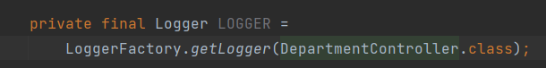
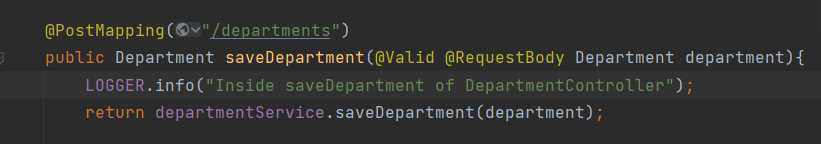

## Exception Handling 

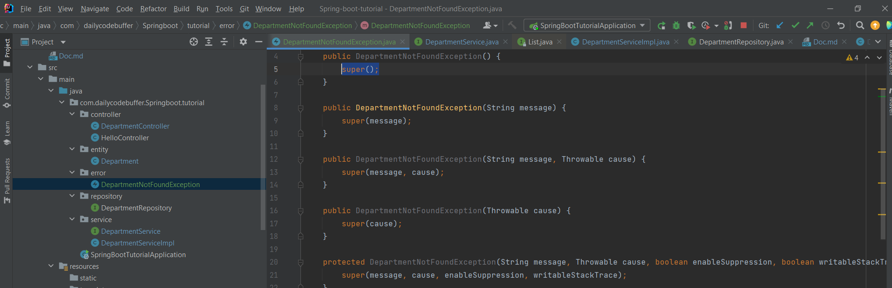

Service Implementation:
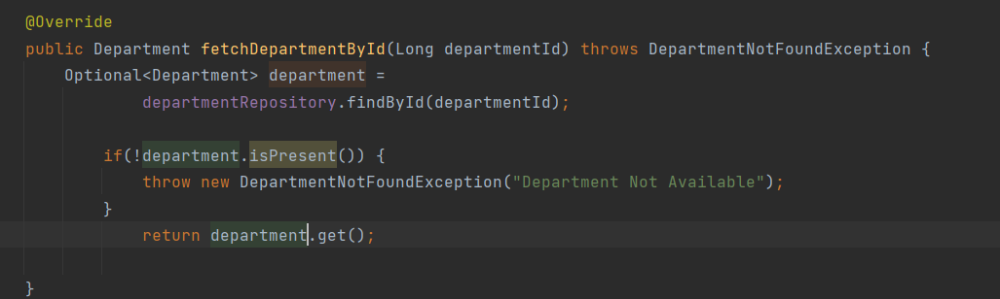
Controller:
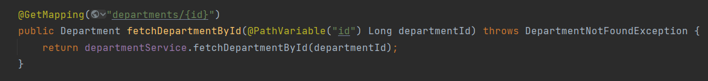

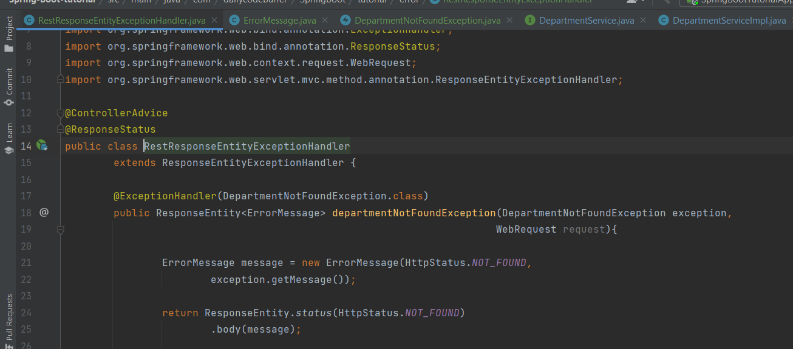
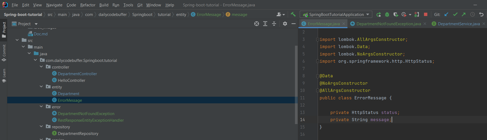

## Change to MySql 

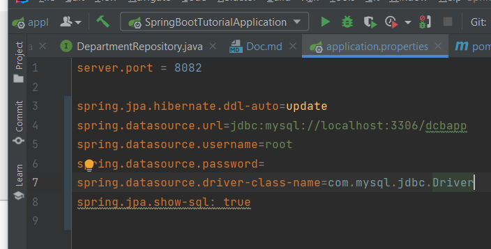
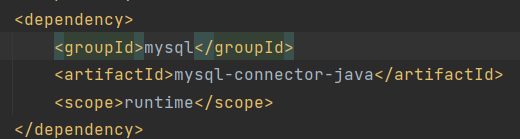
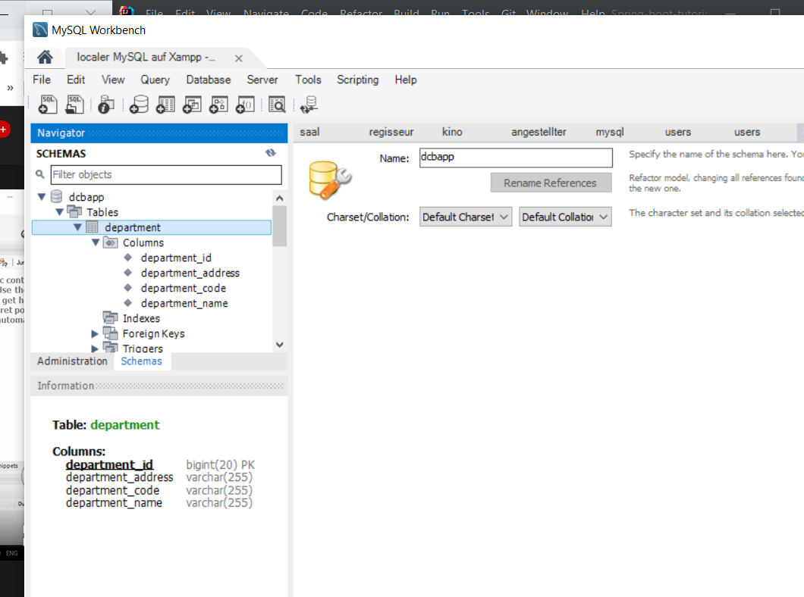

## TESTING 

### Service Layer Testing

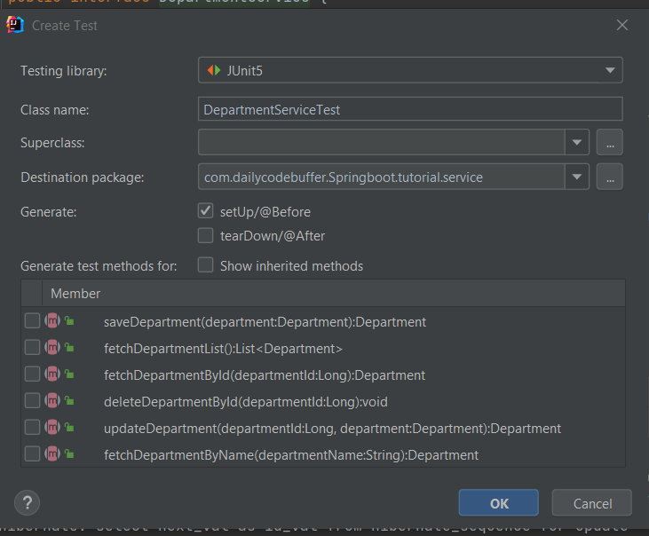
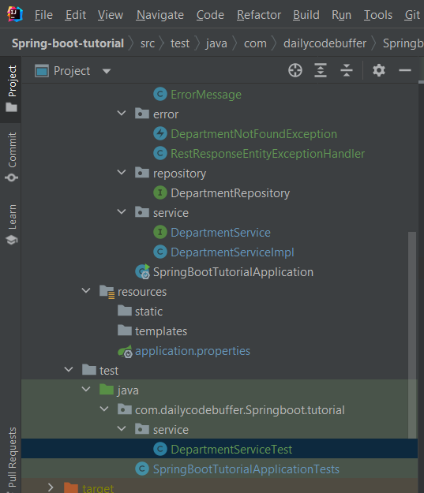

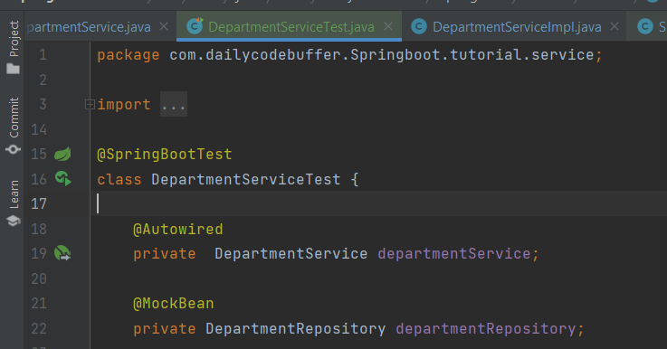
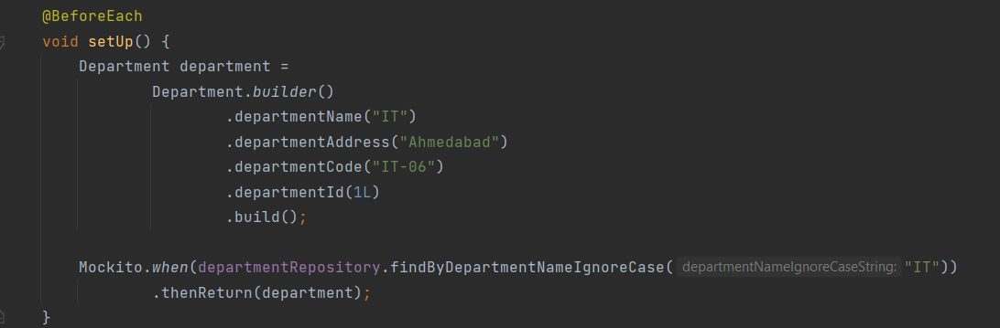
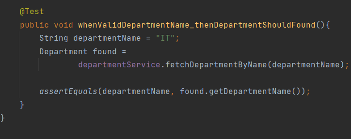
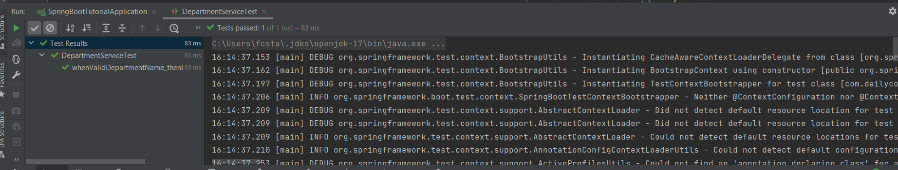

### Repository Layer 
Data will be flushed out.
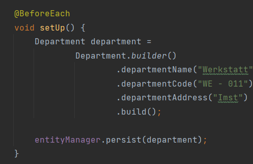

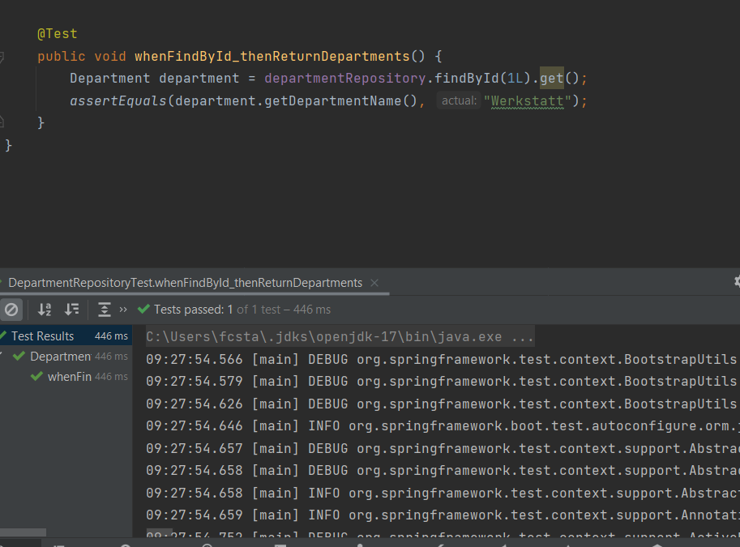

No new Data created:
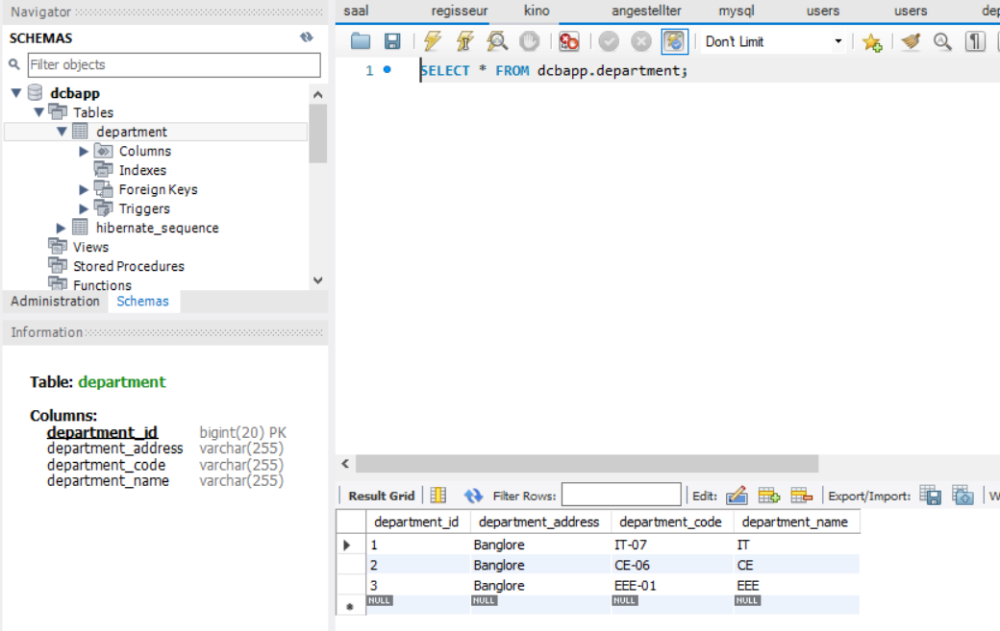

### Controller Layer 
Mock =  in der Softwareentwicklung ein Programmteil, der zur Durchführung von Modultests als Platzhalter für echte Objekte verwendet wird.
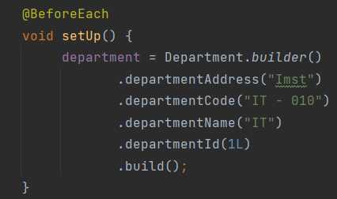

save method:
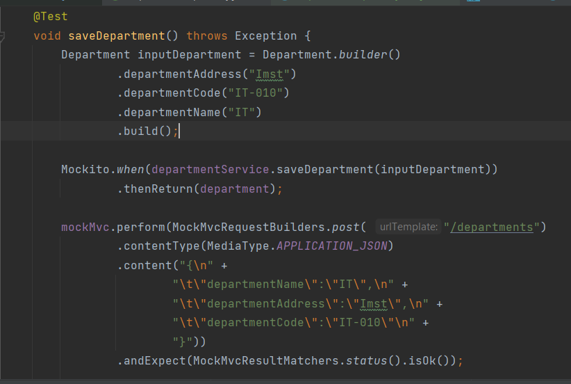

fetchById:
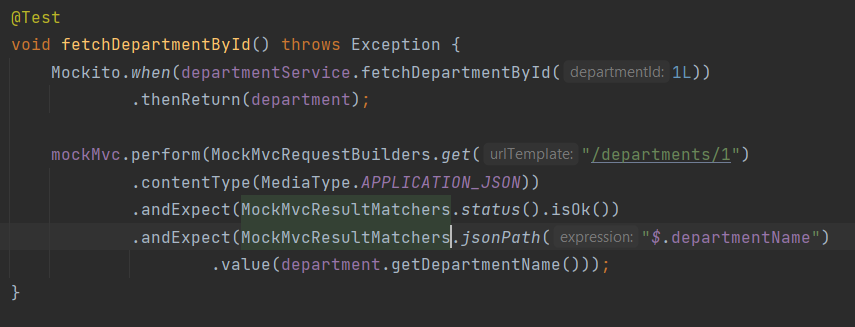

